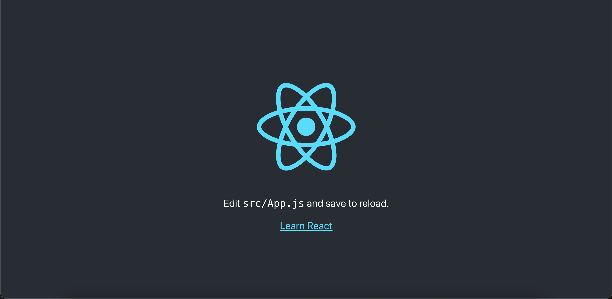

# TOC

* [React.jsについて](#reactjsについて)
   * [React.jsの概要](#reactjsの概要)
   * [Reactを用いた開発](#reactを用いた開発-環境構築から起動まで)
      * [環境構築編](#環境構築編)
      * [起動編](#起動編)
   * [ファイルの中身を理解する](#ファイルの中身を理解する)

## React.jsについて

当ディレクトリでは、Next.jsを利用する際に理解が必須な `React.js` について学習していきます。

そもそも、今回の最終学習目的であるNext.jsはReact.jsをベースとしたフロントエンドフレームワークです。

Next.jsについての詳細は[02-Start_Nextjs](../../02-Start_Nextjs)にて解説します。

## React.jsの概要

React.js(以降はReactと称します)は、Facebook(現在はMeta)社が開発したJavaScriptのライブラリです。

注意すべき点として、Reactはフレームワークではなくライブラリです。

両者の違いとして

```
- ライブラリ
  - 必要な機能のみを取り出して使える為利用する際の環境の自由度が高い

- フレームワーク
  - 開発を行う際に利用できる枠組みのこと。決まった形式で書く為ライブラリよりは自由度が低い
```

以上が挙げられます。

では、Reactを利用するメリットは何でしょうか？

よく挙げられる点としては以下のようなものががあります。

```
- ソースコードがわかりやすい
- コンポーネント指向で拡張・修正が簡単
- 仮想DOMを利用する為描画が早い
```

詳細は

- [カゴヤ Reactとは？](https://www.kagoya.jp/howto/it-glossary/develop/react/)
- [React](https://ja.reactjs.org/https://ja.reactjs.org/)

この辺りを確認してください。特に、仮想domやコンポーネント指向に関してはReact,Next.js問わず必須の知識なので学習をお勧めします。

座学はこの辺りにして、実際にReactを用いたアプリケーションを作成してみましょう！

## Reactを用いた開発 環境構築から起動まで

Reactを使用する際には２通りの方法があります。

一つは０からファイルを作成、Reactをインストールする方法です。

こちらはWebpack等細かなチューニングをしたい方向けになります。

今回は二つ目の方法である、雛形を用いた環境構築を行います。

### 環境構築編

Reactを用いた開発を行う際に、用意されたテンプレートを利用することができます。

前提条件として、Node.jsがインストールされている必要があります。

まだインストールがお済みでない場合は[こちら](../../01-basic/install-node.js)を確認・インストールしてください。

では早速構築していきましょう！

ターミナル上でお好きなディレクトリに移動の上

```
npx create-react-app 好きな名前
```

と実行してください。「好きな名前」の部分は英語で各自好きな名前に置き換えてください。

画面上に様々な情報が表示されていると思われますが、ひとまずその辺は置いておいて。

画面上に `Happy hacking!` と表示されれば構築の完了です。簡単でしょう？

では、次は実際にアプリケーションの起動をしてみます。

### 起動編

では、まずは作成したアプリケーションディレクトリに移動します

```
cd 先ほど入力した名前
↓
npm start
```

と入力することでアプリケーションが起動します。

自動的にブラウザが開いたはずです。そして画面にはこのように表示されていることでしょう。完璧です！



では、起動したので停止しましょう。起動中のターミナル上で

```
controlボタン + c
```

を押してみましょう、するとアプリケーションは停止します。

## ファイルの中身を理解する

環境構築〜起動、停止までの動作を一通り体験したところでここからは実際にファイルを編集していきますので、お好きなエディタで開いてください。

編集するにあたり使用するソフトは何を使っても問題ありません、おすすめはVSCodeです。

では先ほど構築したアプリケーションのフォルダを確認してみましょう！

```
.
├── README.md
├── package.json
├── public
│   ├── favicon.ico
│   ├── index.html
│   ├── logo192.png
│   ├── logo512.png
│   ├── manifest.json
│   └── robots.txt
├── src
│   ├── App.css
│   ├── App.js
│   ├── App.test.js
│   ├── index.css
│   ├── index.js
│   ├── logo.svg
│   ├── reportWebVitals.js
│   └── setupTests.js
├── node_modules 
└── yarn.lock
```

上記のような構成になっているはずです。まずは不要なファイルを削除していきましょう。

ターミナルにて

```
cd src
rm App.css App.test.js logo.svg reportWebVitals.js setupTests.js
```

完了すると以下の構成になります。

```
.
├── README.md
├── package.json
├── public
│   ├── favicon.ico
│   ├── index.html
│   ├── logo192.png
│   ├── logo512.png
│   ├── manifest.json
│   └── robots.txt
├── src
│   ├── App.js
│   ├── index.css
│   └── index.js
└── yarn.lock
```

たった今削除したファイルはcssファイルであったりテストファイルです。今回のチュートリアルでは必要ないので削除しました。

削除した状態でアプリケーションを起動するとエラーが発生します。これは存在しないファイルを呼び出している為です。

では、不要な部分を削除しましょう。

src/index.jsから

```
import reportWebVitals from './reportWebVitals';

// If you want to start measuring performance in your app, pass a function
// to log results (for example: reportWebVitals(console.log))
// or send to an analytics endpoint. Learn more: https://bit.ly/CRA-vitals
reportWebVitals();

```

src/App.jsから

```
import logo from './logo.svg';
import './App.css';

<header className="App-header">
  
  <p>
  Edit <code>src/App.js</code> and save to reload.
  </p>
  <a className="App-link" 
     href="https://reactjs.org"
     target="_blank"
     rel="noopener noreferrer"
   >
   Learn React
   </a>
</header>

```

上記部分を削除してください。

また、src/App.jsのdivタグの中に

```
  <p>Hello React!</p>
```

を追加してください。

ここまで完了しましたら改めて起動してみましょう。

このように表示されていれば完了です！


